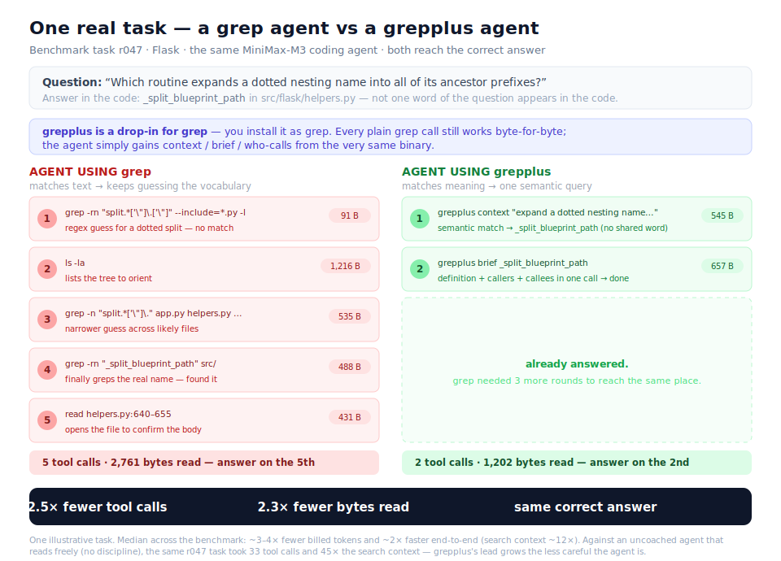

# grepplus

**A fully backward-compatible `grep` — plus code-navigation commands that make coding agents ~2× faster and ~3–4× cheaper. One native Rust binary.**

Install it as `grep` and nothing changes: every normal grep command works byte-for-byte. But the same binary *also* answers the questions a coding agent normally burns rounds on — *who calls this function, what breaks if I change it, where is the code that does X* — in a single call. Tell your agent about them with one line in its system prompt (below), and it stops looping.

```bash
# Backward-compatible: it IS grep. Every grep command works, unchanged.
grep -rn "TODO" src/
grep -i "connection refused" server.log

# Plus — the same `grep`, extra commands for code navigation:
grep who-calls parse_config                 # who calls this function
grep impact User --direction incoming       # what breaks if I change User
grep context "restrict a value to a range"  # find code by meaning, not keyword
grep brief _split_blueprint_path            # definition + callers + callees, one call
```



> **Honest status:** early, in active development — a Rust port of a larger C code-intelligence engine (~40% ported, ~18 languages for cross-file `CALLS`/`IMPORTS`, Rust adds `TYPE_REF`/`USES`). Not production-ready. It is **not** a zero-config 1:1 drop-in: an agent uses the extra commands only when its system prompt mentions them (one line, below) — that is the intended, supported setup. The numbers are real, reproducible medians from an agent benchmark (MiniMax-M3, real repos), with the fixed system prompt excluded as warmup.

---

## Setup — two steps

**1. Install it as `grep`** and index the repo (one time):

```bash
cargo build --release --bin grepplus                              # build the one binary
sudo install -m 0755 target/release/grepplus /usr/local/bin/grep  # install it AS grep (system /bin/grep is untouched)
grepplus index /path/to/repo                                      # index once (setup cost, not per query)
#   for semantic ("find code by meaning") search, add:
#     --embeddings --embedding-gguf <embeddinggemma-300M-Q4_K.gguf> --embedding-tokenizer <tokenizer.json>
```

Prefer a prebuilt binary? Download one for macOS / Linux / Windows from the [Releases](../../releases) page and put it on your `PATH` as `grep`. (Uninstall: remove the binary and `rm -rf "${GREPPLUS_STORE_DIR:-$HOME/Library/Caches/grepplus}"`.)

**2. Tell your agent** — paste the text below **verbatim** into the file your agent reads for project instructions. This is the *only* integration:

| Agent | Paste it into |
|---|---|
| **Claude Code** | `CLAUDE.md` in the repo root |
| **OpenAI Codex** | `AGENTS.md` in the repo root |
| **Cursor** | `.cursor/rules` |
| **Windsurf** | `.windsurfrules` |
| **Anything else / raw API** | the model's **system prompt** |

The exact text to paste:

```text
This project's `grep` is a backward-compatible superset of grep: every normal
grep command still works. It ALSO answers code-navigation questions — prefer
these over grep+read loops:
- grep who-calls SYM / grep callees SYM / grep find-usages SYM
- grep impact SYM --direction incoming      # what breaks if SYM changes
- grep path --from A --to B                  # the call chain from A to B
- grep context "plain-English description"   # find code by meaning, not keyword
- grep brief SYM                             # definition + callers + callees, one call
Be efficient: one impact/context/who-calls call beats many greps. Stop as soon
as you can answer.
```

That prompt is the *whole* integration. Everything else — searching, reading — the agent already knows. **Bonus:** even without the prompt, an exploratory `grep` over an indexed repo appends one self-describing context file (definition, callers, suggested next reads, and the command list), so a capable agent can discover the commands from grep's own output.

---

## What it saves

Real medians from the agent benchmark (MiniMax-M3; grepplus-equipped agent vs. an uncoached grep agent; the fixed system prompt is warmup and factored out of every ratio):

| What you actually pay | Median | |
|---|---:|---|
| **Billed input tokens** (prompt-neutral) | **~3.7×** | cheaper |
| **Output tokens** | **~2.9×** | fewer |
| **Wall-clock time** (session, no setup) | **~2.0×** | faster |
| **Tool-call rounds** (model calls) | **~4.0×** | fewer |

All of it comes from one thing: **fewer model round-trips.** The savings concentrate where `grep` structurally loops and vanish where it is already optimal:

| Task class | search-context median | Why |
|---|---:|---|
| structural graph queries (who-calls / callees / impact) | ~19× | one resolved graph call instead of grep+read per caller |
| research / multi-hop trace | ~13× | one `impact`/`path` call replaces a manual graph walk |
| vocabulary-gap discovery (semantic) | ~2.4× | vector search finds what keywords miss; capped by the small Q4 model |
| literal definition search | ~1× | grep's home turf — it passes straight through |

---

## How it works

- **Backward-compatible grep.** Any invocation that isn't one of the extra subcommands is forwarded to the real `grep`, returning its stdout/stderr and exit code **verbatim** — even for non-UTF-8 patterns. Scripts don't notice.
- **A precomputed code graph.** An indexed, typed symbol graph (`CALLS`/`USES`/`TYPE_REF`/`IMPORTS`) answers `who-calls`/`callees`/`find-usages`/`impact`/`path` directly — resolved relationships with `file:line`, not textual name matches — collapsing several grep+read rounds into one call.
- **Native semantic search.** For a natural-language query that shares no words with the code, it embeds the query with Google's **EmbeddingGemma** (pure-Rust [candle](https://github.com/huggingface/candle) — no llama.cpp, no Python, no HTTP) and does exact cosine nearest-neighbour search over code-span embeddings.
- **One-shot briefings.** `brief SYM` returns definition + callers + callees in one call; `impact SYM` returns the whole transitive blast-radius in one call.
- **Freshness-gated incremental index** so a stale graph never hands the agent a confidently-wrong answer; re-indexing reparses only changed files.
- **One native Rust binary.** At runtime it links only system libraries; tree-sitter parsers and SQLite are compiled in statically.

---

## Status & scope

- **~40%** of the upstream C engine ported; **~18 languages** for cross-file `CALLS`/`IMPORTS` (Rust adds `TYPE_REF`/`USES`).
- The extra commands are activated by the agent's system prompt (above). Today the passthrough intercepts **`grep`**; interception of `ripgrep` (`rg`), which many agents prefer, is in progress.
- The passthrough is **byte-exact** on a miss and for scripted/piped grep; on a match over a fresh index it may append one clearly-labelled non-canonical context line.
- Not production-ready. Use it as a fast code-navigation aid, not a system of record.

## Reproducing the numbers

The exact harness is under [`bench/agent_efficiency/`](bench/agent_efficiency/) (see its README for baseline definitions and why the fixed system prompt is excluded as warmup).

## License

MIT — see [LICENSE](LICENSE). Third-party notices: [THIRD_PARTY.md](THIRD_PARTY.md).
