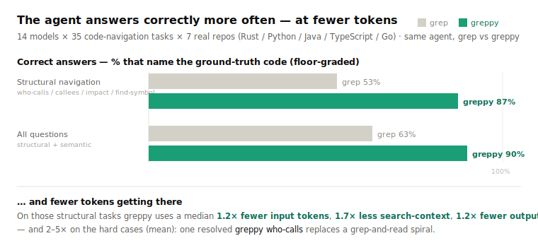

# greppy

**Standard `grep`, plus a few commands your coding agent uses to navigate code — `who-calls`, `impact`, `semantic-search`, `brief`. On structural code-navigation questions the agent answers correctly ~87% of the time instead of ~53% with plain grep — using fewer tokens. One native Rust binary.**

[](https://github.com/metric-space-ai/greppy/releases/latest)
[](LICENSE)

`greppy` is a drop-in `grep` — every flag works exactly as before — that *also*
answers the questions an agent normally burns rounds on: *who calls this
function, what breaks if I change it, where is the code that does X.* One line in
your agent's config (below) tells it the extra commands exist, and it stops
looping through text matches.

```bash
# Standard grep — every command works, unchanged:
greppy -rn "TODO" src/
greppy -i "connection refused" server.log

# A few extra commands, on the same binary:
greppy who-calls parse_config                  # who calls this function
greppy impact User --direction incoming        # what breaks if I change User
greppy semantic-search "restrict a value to a range"   # find code by meaning
greppy brief _split_blueprint_path             # definition + callers + callees
```


<sub>The **same** coding agent (MiniMax-M3, driven by [Pi Code](https://pi.dev)) answers one *who-calls* question on a real repo — **left with plain `grep`, right with `greppy`**. greppy resolves the callers in a single `greppy who-calls` call instead of a grep-and-read spiral: **2.3× faster, 14 → 5 tool calls, ~9× fewer input tokens**. Counters are live from the recorded run.</sub>

---

## Setup — two steps

**1. Install the binary.**

```bash
cargo build --release --bin greppy --features embedded-model
sudo install -m 0755 target/release/greppy /usr/local/bin/greppy
```

Everything is automatic — the code graph and the semantic model are **built into
the binary** and build themselves on first use. Nothing to index, nothing to
download, no flags to configure. (Prebuilt binaries for macOS / Linux / Windows
are on the [Releases](../../releases) page.) Want it as a transparent `grep`
drop-in too? Install it a second time as `grep`.

**2. Tell your agent the extra commands exist.** Delegate it — in your agent's
chat, say **`install https://github.com/metric-space-ai/greppy/`** — or
paste the snippet below into the file your agent reads for project instructions
(`CLAUDE.md`, `AGENTS.md`, `.cursor/rules`, `.windsurfrules`, or the system
prompt).

```text
This project has `greppy` — standard grep plus a few code-navigation commands
over a prebuilt symbol graph and an on-device semantic index. Every normal grep
invocation (and flag) works exactly as usual.

CODE-NAVIGATION COMMANDS. SYMBOL is a function / method / class / type name.
They return resolved results as `qualified_name file:line`, not text matches:
  greppy who-calls SYMBOL        the callers of SYMBOL (incoming calls)
  greppy callees SYMBOL          the functions SYMBOL calls (outgoing calls)
  greppy find-usages SYMBOL      every reference to SYMBOL (calls, uses, imports)
  greppy brief SYMBOL            SYMBOL's definition plus its callers and callees, in one call
  greppy impact SYMBOL           the transitive set of code a change to SYMBOL reaches
  greppy search-symbols NAME     definitions whose name matches NAME (a name or fragment)
  greppy path --from A --to B    a call chain from symbol A to symbol B, if one exists

SEMANTIC SEARCH — use when you do NOT know the symbol's name:
  greppy semantic-search "PLAIN-ENGLISH DESCRIPTION"
      Describe the behaviour or code you are looking for in plain English
      (e.g. "restrict a value to a range", "retry a failed HTTP request").
      Returns the signature and file:line of the closest-matching definitions
      to OPEN AND READ — a locator, not a written answer.

FLAGS (append to any command above):
  --code            include each result's source lines (so no separate read is needed)
  --all             return every result (turn off the default truncation)
  --json            machine-readable output with exact counts
  --root DIR        run against a repo other than the current directory
  --kind KIND       (search-symbols) restrict to function|method|class|struct|enum|trait
  --direction incoming|outgoing, --depth N   (impact) which way and how far to walk
  --from A --to B   (path) the two endpoint symbols

Prefer these over grepping a symbol name and reading every hit: who-calls /
callees / impact answer relationship questions directly, and semantic-search
finds code you cannot name.
```

---

## What it saves

What an agent actually pays for is **billed tokens** and **wall-clock time.**



The benchmark: **14 coding-agent models** (Claude Opus/Sonnet/Fable, GPT-5.5, Gemini, Grok, DeepSeek, Qwen, GLM, Kimi, MiniMax-M3, …), each driven by [Pi Code](https://pi.dev), answer **35 code-navigation questions** across **7 real repositories** (Rust `serde` + `tokio`, Python `flask` + `django`, Java `gson`, TypeScript `zod`, Go `hugo`). Every task runs twice — once with plain `grep`, once with `greppy`, **same agent, same prompt.** Answers are **floor-graded**: a pass must name the ground-truth symbol/file (each anchor rg-verified at generation time). The harness is in [`bench/agent_efficiency/`](bench/agent_efficiency/).

**Correctness is the headline.** On **structural navigation** — *who-calls*, *callees*, *impact/blast-radius*, *find-symbol* — the agent answers correctly **87% of the time with greppy vs 53% with plain grep** (graded by the repo's own [`grade_answers.py`](bench/agent_efficiency/grade_answers.py)). Across all 35 questions: **90% vs 63%.** Plain grep is cheap but frequently confidently wrong; greppy resolves the relationship in one call.

| On structural navigation questions | grep | greppy |
|---|---:|---:|
| **Answered correctly** (floor-graded) | 53% | **87%** |
| **Input tokens** (median · mean saving) | 1× | **1.2× · 2.3× fewer** |
| **Search-context tokens** (median · mean) | 1× | **1.7× · 5.1× less** |
| **Output tokens** (median) | 1× | **1.2× fewer** |

So it is not a cost-for-accuracy trade: on structural questions greppy is **both more correct and cheaper.**

**Where plain grep keeps up:** open-ended *"how does this subsystem work"* questions. Both tools reach the answer there (~98% correct either way), but greppy's precise locator makes the agent read more to explain the *mechanism*, so it costs a little **more**. greppy's edge is **pinpoint / structural** questions — the semantic path is being tuned to also lead the agent to the answer in one step.

**The gain depends on the model.** Across the 14 models the structural token-saving ranged from ~parity (Opus 4.8, Gemini 3.1 Pro) to **~1.8×** (Sonnet 5, Fable 5, MiniMax-M3), and did **not** track a model's general agentic-benchmark score. Benchmark your own model — most come out ahead, and every model gets the correctness lift.

---

## How it works

- **Standard grep.** Any invocation that isn't one of the extra commands runs real `grep` and returns its output and exit code unchanged.
- **A precomputed code graph.** An indexed, typed symbol graph (`CALLS`/`USES`/`TYPE_REF`/`IMPORTS`) answers `who-calls`/`callees`/`find-usages`/`impact`/`path` directly — resolved relationships with `file:line`, not text matches — collapsing several grep+read rounds into one call.
- **Native semantic search.** For a natural-language query that shares no words with the code, `semantic-search` embeds the query with Google's **EmbeddingGemma** on greppy's own native Rust inference (CPU / Apple Metal / NVIDIA CUDA, auto-detected — no llama.cpp, no Python, no HTTP) and returns the nearest code spans by meaning. A small warm daemon keeps the model resident between calls and drops it after idle, so it never holds GPU memory while you're not searching.
- **One native Rust binary.** The EmbeddingGemma model is baked into the binary; tree-sitter parsers and SQLite are compiled in statically.

---

## Status

Early and evolving — the drop-in `grep` core is solid; the intelligence layers around it are beta.

- **Solid:** the `grep` drop-in and the code-graph commands (`who-calls` / `callees` / `find-usages` / `impact` / `path` / `brief`) on supported languages.
- **Supported languages (107):** `python`, `csharp`, `go`, `cpp`, `php`, `rust`, `swift`, `scala`, `c`, `java`, `javascript`, `typescript`, `ruby`, `bash`, `kotlin`, `fsharp`, `julia`, `ocaml`, `d`, `gdscript`, `zig`, `elm`, `erlang`, `crystal`, `gleam`, `objc`, `solidity`, `prisma`, `protobuf`, `css`, `dockerfile`, `json`, `groovy`, `lua`, `sql`, `make`, `nix`, `cmake`, `dart`, `fortran`, `elixir`, `scheme`, `vue`, `astro`, `svelte`, `verilog`, `glsl`, `hcl`, `matlab`, `r`, `purescript`, `racket`, `clojure`, `haskell`, `cuda`, `tcl`, `graphql`, `pascal`, `powershell`, `html`, `yaml`, `hlsl`, `cobol`, `fish`, `ini`, `vhdl`, `json5`, `awk`, `cairo`, `ada`, `hare`, `kdl`, `jsonnet`, `llvm`, `janet`, `jinja2`, `bicep`, `gotemplate`, `just`, `devicetree`, `liquid`, `assembly`, `hyprlang`, `gn`, `blade`, `cfml`, `cfscript`, `csv`, `bibtex`, `beancount`, `gitattributes`, `markdown`, `toml`, `xml`, `scss`, `perl`, `fennel`, `starlark`, `ron`, `dotenv`, `properties`, `po`, `diff`, `rst`, `mermaid`, `regex`, `linkerscript`. More land in each release.
- **Beta:** `semantic-search` — the on-device EmbeddingGemma inference is solid and the model ships inside the binary. Newer than the graph commands, so still labelled beta.

Not yet production-ready — use it as a fast code-navigation aid, not a system of record.

## License

MIT — see [LICENSE](LICENSE). Third-party notices: [THIRD_PARTY.md](THIRD_PARTY.md).
