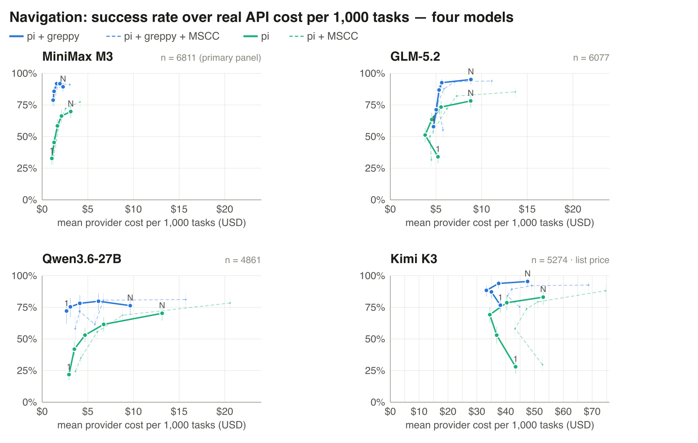

# greppy

**Local code navigation for coding agents: deterministic symbol-graph evidence, native semantic search, compact function briefings, and byte-exact real-`grep` passthrough. One native Rust binary.**

[](https://github.com/metric-space-ai/greppy/actions/workflows/ci.yml?query=branch%3Amain)
[](https://github.com/metric-space-ai/greppy/actions/workflows/codeql.yml?query=branch%3Amain)
[](LICENSE)

> In our 115-task, four-model benchmark (MiniMax-M3, GLM-5.2, Qwen3.6-27B,
> Kimi-K3), an agent with greppy answered 6–50 percentage points more
> questions correctly than the same agent with `grep`, and matched the grep
> agent's best quality at 37–80 % lower API cost.
> Method and full results: [paper](docs/paper/mscc-greppy-paper.pdf); the
> benchmark suites are in this repo.

`greppy` is a code-navigation tool that also accepts ordinary `grep`
invocations. Those invocations execute the real system `grep` and forward its
stdout, stderr, and exit code byte-for-byte; they do not open an index, load a
model, or mutate a Greppy cache. Greppy is installed only as `greppy`, never as
a global `grep` replacement.

Its structured commands answer questions an agent otherwise spends several
search-and-read rounds on: *who calls this function, what breaks if I change it,
where is the code that does X.* Deterministic source and graph evidence is the
authority. Locally generated summaries are short navigation hints attached to
the exact source signature, not a replacement for reading the returned code.

Everything runs on your machine: index, symbol graph, embeddings, and
summaries are computed locally by the embedded models. No network calls at
runtime, no telemetry, no account — greppy works offline and air-gapped. The
only downloads are the model files at build time (prebuilt binaries already
contain them).

```bash
# Standard grep — every command works, unchanged:
greppy -rn "TODO" src/
greppy -i "connection refused" server.log

# A few extra commands, on the same binary:
greppy who-calls parse_config                  # who calls this function
greppy impact User --direction incoming        # what breaks if I change User
greppy semantic-search "restrict a value to a range"   # find code by meaning
greppy brief _split_blueprint_path             # definition + callers + callees
```


<sub>The **same** coding agent (MiniMax-M3, driven by [Pi Code](https://pi.dev)) answers one *who-calls* question on a real repo — **left with plain `grep`, right with `greppy`**. The measured evidence is below.</sub>

---

## Benchmark results

Across four coding models and three providers, the agent with greppy answered
more tasks correctly at every tool-call budget (+6 to +50 percentage points)
and reached the grep agent's best quality at 37–80 % lower billed API cost.



<sub>Success rate vs. mean billed API cost per 1,000 tasks. Blue = agent with greppy, green = same agent with grep. The dashed lines are the 2×2 ablation: adding an explicit method instruction changes nothing except cost — the tool surface carries the effect.</sub>

> 📄 **Full paper:** [*The Minimum Sufficient Code Context Problem — Complexity, Discovery Overhead, and Approximation in Coding Agents*](docs/paper/mscc-greppy-paper.pdf) — the graph formulation of MSCC, its NP-completeness, the lexical-navigation lower bounds, the no-trade-off theorem, and the full four-model empirical evidence.

---

## Setup — two steps

**1. Install.** Both install paths produce a binary with the two models
embedded.

*Prebuilt binary* (macOS arm64, Linux x86_64, Windows x86_64 — see
[SUPPORT.md](SUPPORT.md) for the exact target list):

```bash
version=v0.2.1
asset=greppy-macos-arm64.tar.gz        # or greppy-linux-x86_64.tar.gz
gh release download "$version" --repo metric-space-ai/greppy \
  --pattern "$asset" --pattern SHA256SUMS
shasum -a 256 --ignore-missing -c SHA256SUMS
tar -xzf "$asset"
install -m 0755 greppy "$HOME/.local/bin/greppy"   # no sudo needed
```

Windows: download `greppy-windows-x86_64.zip` from the
[releases page](https://github.com/metric-space-ai/greppy/releases), verify it
against `SHA256SUMS`, unzip, and put `greppy.exe` on `PATH`. Signature and
provenance verification: [SECURITY.md](SECURITY.md). The models are already in
the binary.

*Build from source* (needs Rust ≥ 1.95, a C toolchain, `jq`, `curl`;
downloads ~780 MB of model files):

```bash
git clone https://github.com/metric-space-ai/greppy && cd greppy
git checkout v0.2.1
./tools/fetch_model_assets.sh
cargo build --locked --release --bin greppy
install -m 0755 target/release/greppy "$HOME/.local/bin/greppy"
```

`cargo build` fails if a model asset is missing or its SHA-256 does not match
([`crates/cli/build.rs`](crates/cli/build.rs)). `fetch_model_assets.sh` is
idempotent — it verifies existing files and re-downloads only on mismatch.
Add `--features metal`
(Apple Silicon) or `--features cuda` (Linux/NVIDIA) for the accelerated backend;
CPU inference always works, and the device is selected automatically (override
with `--device cpu|metal|cuda[:INDEX]` or `GREPPY_DEVICE`).

The binary embeds EmbeddingGemma (300M) and an in-house Qwen3.5 (0.8B)
fine-tune that writes the navigation hints. The weights live on Hugging Face
([EmbeddingGemma](https://huggingface.co/metricspace/embeddinggemma-300m-q4k),
[greppy-Qwen3.5](https://huggingface.co/metricspace/greppy-qwen35-mtp-q4km)),
pinned by SHA-256 in
[`MODEL_ASSETS.json`](crates/cli/assets/MODEL_ASSETS.json) and fetched at build
time — no token needed. Nothing is downloaded at runtime. Don't install the
binary as `grep`.

First run:

```bash
greppy --version
greppy doctor --root . --json     # index + backend health
greppy who-calls SOME_SYMBOL --root . --json   # first query builds the index
```

The index is built once per repository and reused across sessions. While
embeddings are still building, `semantic-search --json` returns
`status: "indexing"` with progress and an ETA (exit 75) — retry it later or
poll `greppy index status`; graph commands work immediately.

Measured footprint (serde, 339 files / 4,573 symbols, hosted CI runners —
numbers from the `runtime-footprint-*.json` assets on the release):

| | |
|---|---|
| Release archive | 735–825 MB (models included) |
| Installed binary | ~1 GB |
| Graph index build | ~2 s (Apple Silicon), ~4 s (4-core Linux) — queries work immediately |
| Semantic embeddings | background, one-time per repo: ~24 min (M-series CPU), ~63 min (4-core Linux CPU) |
| Warm query, Metal | `brief` 0.7 s · `semantic-search` 1.5 s |
| Warm query, CPU only | `brief` 3.6–7 s · `semantic-search` 6–16 s |
| Per-repo store | ~32 MB; extracted model cache 814 MB, 10 GiB quota with GC |

**2. Add the prompt to your agent.** That's the whole integration — no MCP
server, no per-agent config, no API keys. Works in any agent that can run
shell commands (Claude Code, Cursor, Codex CLI, Gemini CLI, your own).

The prompt ships as [`AGENTS.md`](AGENTS.md) in this repo. Copy it into your
repo root — agents that read `AGENTS.md` pick it up automatically; for Claude
Code, add the line `@AGENTS.md` to your `CLAUDE.md` (that's all this repo's
[`CLAUDE.md`](CLAUDE.md) contains). Or paste the block below into your
project-instructions file, or tell your agent:
`install https://github.com/metric-space-ai/greppy/`. The index builds itself
on the first query.

### The agent prompt (use as-is)

This is the exact prompt from the published benchmarks. Custom routing or
method instructions on top measurably change nothing except prompt cost
(paper, 2×2 ablation).

```text
This project has `greppy`, a local code-navigation tool over a symbol graph and
an on-device semantic index. Ordinary grep invocations are delegated byte-for-
byte to the real system grep, but Greppy must not be installed or invoked as a
global grep alias.

CODE-NAVIGATION COMMANDS. SYMBOL is a function / method / class / type name.
They return resolved results as `qualified_name file:line`, not text matches:
  greppy who-calls SYMBOL        the callers of SYMBOL (incoming calls)
  greppy callees SYMBOL          the functions SYMBOL calls (outgoing calls)
  greppy find-usages SYMBOL      every reference to SYMBOL (calls, uses, imports)
  greppy brief SYMBOL            SYMBOL's definition plus its callers and callees, in one call
  greppy impact SYMBOL           the transitive set of code a change to SYMBOL reaches
  greppy search-symbols NAME     definitions whose name matches NAME (a name or fragment)
  greppy path --from A --to B    a call chain from symbol A to symbol B, if one exists

SEMANTIC SEARCH — use when you do NOT know the symbol's name:
  greppy semantic-search "PLAIN-ENGLISH DESCRIPTION"
      Describe the behaviour or code you are looking for in plain English
      (e.g. "restrict a value to a range", "retry a failed HTTP request").
      Returns the closest-matching definitions by meaning (signature + file:line).
      While first-use embeddings are still building, returns a retryable status
      with the active backend, progress, and ETA instead of partial/empty hits.

EXPAND — get the full source in one call instead of opening files by hand:
  greppy expand ID
      who-calls / callees / impact / semantic-search may end their output with a
      line `Expand: greppy expand <id>`. Run it to print the prepared evidence
      pack — the full source of the top matches, bundled — in a single call,
      instead of reading each file:line yourself.

FLAGS (append to any command above):
  --code            include each result's source lines (so no separate read is needed)
  --all             return every result (turn off the default truncation)
  --json            machine-readable output with exact counts
  --root DIR        run against a repo other than the current directory
  --kind KIND       (search-symbols) restrict to function|method|class|struct|enum|trait
  --direction incoming|outgoing, --depth N   (impact) which way and how far to walk
  --from A --to B   (path) the two endpoint symbols

Prefer these over grepping a symbol name and reading every hit: who-calls /
callees / impact answer relationship questions directly, and semantic-search
finds code you cannot name.

Treat returned source paths, exact spans, signatures, and graph relations as
evidence. The indented English sentence below a function signature is a local
Qwen navigation hint. Read the source and verify changes with builds and tests.
```

## CLI reference

Every command runs on the current repository, or pass `--root DIR`. Structured
queries print `qualified_name file:line`; add `--code` to include each result's
source, `--all` to lift the default result cap, and `--json` for machine-readable
output with exact counts. The first structured query builds the index; ordinary
`grep` invocations pass straight through to the system `grep`.

**Navigate the symbol graph**

| Command | Answers |
|---|---|
| `greppy who-calls SYMBOL` | the callers of `SYMBOL` (incoming calls) |
| `greppy callees SYMBOL` | the functions `SYMBOL` calls (outgoing calls) |
| `greppy find-usages SYMBOL` | every reference — calls, uses, imports |
| `greppy references SYMBOL` | every incoming graph reference, without content-search fallback noise |
| `greppy impact SYMBOL` | the transitive blast-radius in one call — `--direction incoming` (what breaks if I change it, default) or `outgoing` (what it reaches); tune with `--depth N`, `--since REV`, `--base BRANCH` |
| `greppy brief SYMBOL` | definition + direct callers + callees, in a single call |
| `greppy path --from A --to B` | a call chain from `A` to `B` (`--edge CALLS\|USES\|TYPE_REF\|IMPORTS`) |
| `greppy graph-locate FILE:LINE` | the innermost symbol enclosing a `file:line` location |
| `greppy fan-in` / `greppy fan-out` | the most-called / most-calling symbols in the project |
| `greppy trace SYMBOL` | a call-graph trace |
| `greppy search-graph …` | a structured graph query |

**Search**

| Command | Finds |
|---|---|
| `greppy semantic-search "PLAIN ENGLISH"` | code by meaning (EmbeddingGemma + Qwen hints) — use when you don't know the symbol name |
| `greppy search-symbols NAME` | definitions by name or fragment (`--kind function\|struct\|trait\|…`) |
| `greppy search-code QUERY` | full-text code search |
| `greppy plus QUERY` | fused ranking: literal + symbol + semantic + graph-neighbour signals |
| `greppy expand ID` | the full source of results from a previous query (`Expand: greppy expand <id>`) |

**Workspace & health**

| Command | Does |
|---|---|
| `greppy index [PATH]` | build or refresh the index; `greppy index status` reports progress |
| `greppy stats` | node and edge counts for the project graph |
| `greppy diagnostics` | schema health, integrity, workspace state, provider completeness |
| `greppy doctor` | end-to-end health check of the active index |
| `greppy cache status\|gc\|clear` | inspect or reclaim greppy-managed cache and stores |
| `greppy trial …` | run a local baseline-vs-greppy comparison on your own repository and print a `greppy.project-trial.v1` JSON record |

**Global flags** — accepted before or after the subcommand: `--root DIR`,
`--device auto\|cpu\|metal\|cuda[:INDEX]` (or `GREPPY_DEVICE`), `--json`,
`--code`, `--all`. `greppy --version`, `greppy --help`, and
`greppy <command> --help` print the full detail for any command.

---

## What it saves

Greppy replaces search-and-open loops with one structured query plus attached
source evidence. Two pre-registered benchmark suites are checked in — the
navigation suite gates every release, the coding suite runs and publishes with
every commit ([SECURITY.md](SECURITY.md) has the release scope):

- [`bench/agent_efficiency/`](bench/agent_efficiency/) contains 115 pinned
  navigation tasks across six real repositories plus deterministic controls.
  It measures answer correctness together with search, source-reading, and
  context cost.
- [`bench/agent_coding/`](bench/agent_coding/) contains 30 paired edit-and-test
  tasks across Flask, Hugo, Gson, Zod, Serde, and Tokio. Each task starts from an
  exact commit, proves that its independent test passes before mutation and
  fails after mutation, then runs isolated Greppy and ordinary-exploration arms.
  Setup is outside measured agent time; the post-agent test determines
  correctness.

Both suites record per-task correctness, tool calls, source opens, input/output
tokens, context or prompt volume, and wall time for the same agent and model.
Task banks, prompts, binaries, runtime versions, setup commands, and repository
commits are hashed into their manifests. Arm order is deterministically
balanced per task and its ordering scheme is versioned in the manifest.

Release gates, run on the exact release commit:

- at least as many paired correctness wins as losses, with no paired
  regression alarm at `p < 0.05`;
- at least 20% fewer tool calls and source-open calls on structural tasks;
- at least 20% fewer variable input tokens on structural tasks;
- exact repository commits, task-bank hash, prompt hash, model ID, Greppy
  binary hash, per-task rows, grading, aggregate, and forensics are published;
- raw agent traces remain private and are not release artifacts.

v0.2.1 shipped with these gates green; the run evidence is attached to the
release. Index construction is a one-time cost per repository, reported
separately with its break-even.

---

## How greppy compares

**vs. plain `grep`/`ripgrep` + file reads.** That is the measured baseline: the
same agent answered 6–50 percentage points fewer questions and paid 1.6–5×
more API cost for its best quality. Text search finds occurrences; it does not
resolve callers, callees, or types, so the agent pays for every disambiguation
round. greppy keeps grep — ordinary invocations pass through byte-exact.

**vs. MCP context servers.** Context servers integrate through an MCP server
process, per-agent registration, and tool schemas in the prompt; retrieval is
typically full-text search plus name matching and graph traversal. greppy
integrates by being on `PATH` — one pasted prompt block, no server, no
per-agent config — and its semantic search is real embedding retrieval
(on-device EmbeddingGemma), which finds code you can only describe, not name.
Freshness needs no file watcher: every query validates the index against the
worktree and fails closed rather than answering from stale spans.

**vs. LSP.** An LSP resolves the open project precisely but needs a running
language server per language and an editor-shaped session. greppy is a
stateless CLI over 60+ languages with one index per repository, built for
agents that live in a shell. They compose: the paper's benchmark harness
itself pins LSPs for oracle validation.

The difference to hosted code-search services is simpler: greppy has no
service. Nothing leaves the machine.

## Paper

The navigation problem greppy optimizes is formalized in an accompanying
paper: **“The Minimum Sufficient Code Context Problem — Complexity, Discovery
Overhead, and Approximation in Coding Agents”** (Michael Welsch, GPT-5.6 Sol,
Fable 5.0 — July 2026).
**[Read the PDF](docs/paper/mscc-greppy-paper.pdf)**

It defines the minimum sufficient code context (MSCC) an agent needs for a
task, proves that constructing it exactly is NP-complete, lower-bounds what
purely lexical navigation must pay for entry ambiguity and unresolved
relations, and states the measurable conditions under which the combined
policy greppy implements is strictly cheaper without losing correctness.
The pre-registered factorial study in the paper is the same evidence design
this repository enforces as release gates; the paper ships the frozen protocol
and the four-model panels (115 tasks × 4 conditions × 5 budgets × 3
repetitions per model: MiniMax-M3, GLM-5.2, Qwen3.6-27B, Kimi-K3).

---

## How it works

- **Standard grep.** Any invocation that isn't one of the extra commands runs real `grep` and returns its output and exit code unchanged.
- **A precomputed code graph.** An indexed, typed symbol graph (`CALLS`/`USES`/`TYPE_REF`/`IMPORTS`) answers `who-calls`/`callees`/`find-usages`/`impact`/`path` directly — resolved relationships with `file:line`, not text matches.
- **Native semantic navigation.** `semantic-search` uses Google's embedded **EmbeddingGemma** to find code by meaning. A **Qwen3.5-0.8B (Q4_K_M, MTP) that greppy fine-tuned in-house** — trained by distillation specifically to write code-navigation hints — adds a short purpose hint under each returned function signature and to each definition printed by `brief`. Inference is local Rust plus vendored Metal/CUDA kernels: no llama.cpp runtime, Python, HTTP, or model server.
- **Bounded warm daemons.** The embedding and summary engines use separate local daemons. A used model remains resident for five idle minutes; the process exits after 30 idle minutes. Failed inference never removes deterministic source or graph output.
- **One native Rust binary.** Both model files and tokenizers are baked into every binary; tree-sitter parsers and SQLite are compiled in. CPU is universal, while release artifacts add the native GPU backend for their target platform.

## What the graph cannot see

A symbol graph is built from source text. Edges a program wires up at runtime — reflection, dependency injection, monkeypatching, dynamically dispatched calls, code generated during the build — are invisible to every static tool, greppy included. Greppy is built so these blind spots do not turn into wrong answers:

- `semantic-search` finds code by meaning, not by graph edges. A reflection target or a generated handler is still findable by describing what it does.
- `find-usages` reports references and imports, not only resolved calls — dynamic call sites almost always still name the symbol somewhere in the text.
- The grep passthrough stays available for string-level certainty.
- The shipped agent prompt states the rule outright: an empty result does not prove that no relation exists — switch navigation methods instead of concluding.

Language support is tiered the same way, deliberately: 60+ languages have parser-level support, and graph completeness is certified per language by fixture grids — currently Rust, Python, Java, JavaScript, TypeScript, and Go, with C++, C#, Kotlin, Swift, and Ruby next. Certification means the tier is measured, not assumed.

The index is per repository, deliberately: one root, one store, and multi-package workspaces inside that root (Cargo, npm, Go) are already a single relation space. Multiple repositories are queried per root via `--root`; a federated multi-root workspace — one search across registered roots, with dependency-level edges between them — is planned. What is not planned is a central team server: greppy stays local by design. The team answer is index snapshots — build the index once in CI, distribute it as an artifact, and let the per-query freshness checks reconcile local drift.

## Local data and cleanup

Greppy stores workspace paths, source spans, graph edges, embeddings, and query
cache entries in a local SQLite-backed cache outside the repository. Directories
are private to the current user (`0700` on Unix), and cache objects are managed
only after ownership, type, and path validation. Set `GREPPY_STORE_DIR` to place
the data on an encrypted or ephemeral volume.

Full source bodies are not duplicated into SQLite. Exact code search reads the
current worktree through real `grep` where available, with an in-binary literal
fallback on clean Windows hosts. Freshness checks guard indexed graph spans and
embeddings.

```bash
greppy cache status --json       # inspect paths, sizes, locks, TTL and quota
greppy cache gc --dry-run        # preview TTL/LRU reclamation
greppy cache gc                  # reclaim eligible entries
greppy cache clear --root . --yes
greppy cache clear --all --yes   # explicit destructive operation
```

The default workspace-cache TTL is 14 days. `GREPPY_STORE_TTL_DAYS=0` disables
age eviction but not the independent size quota.

Uninstall — removes all caches, extracted models, and the binary; idle daemons
exit on their own within 30 minutes:

```bash
greppy cache clear --all --yes
rm "$HOME/.local/bin/greppy"     # or wherever you installed it
```

---

## Status

**Current release: [v0.2.1](https://github.com/metric-space-ai/greppy/releases/tag/v0.2.1)**.
Releases ship after CI, CodeQL, the security audit, the task-bank audit, the
agent benchmark, and the summary-quality gate pass on the release commit, then
get signed, notarized, and attested (SBOM + provenance). Pin the tag for
production.

- **Language parsers — 60+ bundled:** every language indexes symbols and answers
  definition and text search; most (every procedural language — Ruby, C++, C#,
  Kotlin, Swift, Elixir, and dozens more, not only the six below) also extract
  call, usage, and import relations, so `who-calls` / `callees` / `impact` work
  out of the box.
- **Graph-completeness certified:** Rust, Python, Java, JavaScript, TypeScript,
  and Go — fixtures and real-repository tests guarantee complete caller/callee/
  usage/impact; other languages extract the same relations without that formal
  guarantee.
- **Supported release targets:** macOS Apple Silicon with Metal, Linux x86_64
  with CPU and NVIDIA CUDA, and Windows x86_64 CPU with named-pipe daemons.
- **Known boundaries:** reflection, runtime dependency injection, generated
  code, macros, and dynamic dispatch can hide relationships from any static
  graph. Freshness checks fail closed rather than knowingly returning stale
  source evidence.

Published releases are immutable and checksummed. Greppy has no self-updater;
pin a release or commit and upgrade through verified release artifacts. See
[SUPPORT.md](SUPPORT.md), [SECURITY.md](SECURITY.md), and
[CHANGELOG.md](CHANGELOG.md).

Contributions follow [CONTRIBUTING.md](CONTRIBUTING.md) and the
[Code of Conduct](CODE_OF_CONDUCT.md). Research and benchmark users can cite
the exact software artifact through [CITATION.cff](CITATION.cff).

## License

Greppy source code is Apache-2.0-licensed. The embedded model weights are **not**
covered by that license and carry their own terms — in particular EmbeddingGemma
is under Google's [Gemma Terms of Use](licenses/GEMMA-TERMS.html) (use
restrictions plus redistribution conditions); Qwen3.5 is Apache-2.0. Before
shipping greppy inside a product, read the binding
[`licenses/EMBEDDED-MODEL-TERMS.md`](licenses/EMBEDDED-MODEL-TERMS.md). See
[LICENSE](LICENSE), [THIRD_PARTY.md](THIRD_PARTY.md), and the model notices under
[`licenses/`](licenses/).
