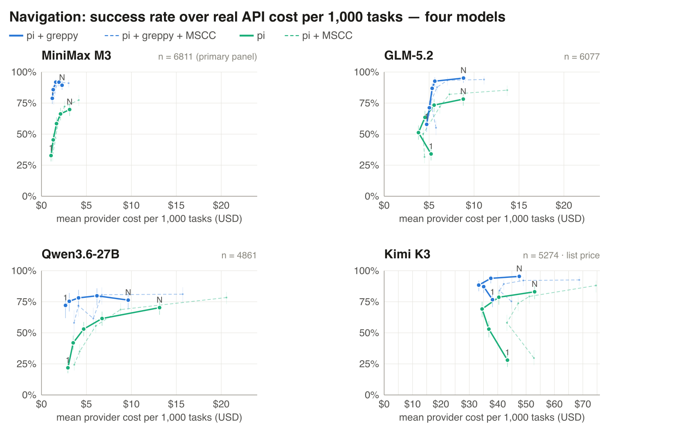

# greppy

**Local code navigation and transactional editing for coding agents: deterministic symbol-graph evidence, native semantic search, compact function briefings, certificate-backed edits, and byte-exact real-`grep` passthrough. One native Rust binary.**

[](https://github.com/metric-space-ai/greppy/actions/workflows/ci.yml?query=branch%3Amain)
[](https://github.com/metric-space-ai/greppy/actions/workflows/codeql.yml?query=branch%3Amain)
[](LICENSE)

> In our 115-task, four-model benchmark (MiniMax-M3, GLM-5.2, Qwen3.6-27B,
> Kimi-K3), an agent with greppy answered 6–50 percentage points more
> questions correctly than the same agent with `grep`, and matched the grep
> agent's best quality at 37–80 % lower API cost.
> Method and full results: [paper](docs/paper/mscc-greppy-paper.pdf); the
> benchmark suites are in this repo.

`greppy` is a code-navigation and code-editing tool that also accepts ordinary
`grep` invocations. Those invocations execute the real system `grep` and forward its
stdout, stderr, and exit code byte-for-byte; they do not open an index, load a
model, or mutate a Greppy cache. ripgrep-style invocations (`--smart-case`,
`-t rust`, `-g '!target'`, …) are recognized too: they delegate byte-exactly
to a real `rg` when one is installed, otherwise the common flag subset is
mapped onto the grep passthrough, and anything grep cannot express fails
loudly with the closest alternative — never a silently different search.
Greppy is installed only as `greppy`, never as a global `grep` replacement.

Its structured commands answer questions an agent otherwise spends several
search-and-read rounds on: *who calls this function, what breaks if I change it,
where is the code that does X.* Deterministic source and graph evidence is the
authority. Locally generated summaries are short navigation hints attached to
the exact source signature, not a replacement for reading the returned code.

Everything runs on your machine: index, symbol graph, embeddings, and
summaries are computed locally by the embedded models. No network calls at
runtime, no telemetry, no account — greppy works offline and air-gapped. The
only downloads are the model files at build time (prebuilt binaries already
contain them).

```bash
# Standard grep — every command works, unchanged:
greppy -rn "TODO" src/
greppy -i "connection refused" server.log

# A few extra commands, on the same binary:
greppy who-calls parse_config                  # who calls this function
greppy impact User --direction incoming        # what breaks if I change User
greppy search "restrict a value to a range"       # find definitions by meaning
greppy brief _split_blueprint_path             # definition + callers + callees

# And since 0.3.0, editing on the same evidence — transactional, certificate-backed:
greppy read parse_config --handle              # exact source + a hash-pinned edit handle
greppy replace parse_config --verify < fix.rs  # one verified symbol replacement
greppy patch --verify < refactor.diff          # coordinated all-or-nothing patch

# And since 0.3.1, a one-shot coding agent on the same binary — local gateway, review-patch:
greppy -p "add tests for clamp_value"          # uses a private portable CoW workspace, returns a proposal ref
greppy -p "keep going" --continue              # resume this project's most recent -p/agent session


# And since 0.3.4, the same agent in an interactive terminal UI:
greppy agent --model MODEL                     # full-screen session, same isolated workspace
greppy agent --continue --model MODEL          # restore this project's most recent session

# In 0.3.4, agents and ordinary linked Git worktrees share immutable Base data:
greppy index --agent-worktree                  # build or validate the shared Base ahead of time
greppy index .                                 # first worktree creates the Base; later worktrees index only their Delta
greppy index status --json                     # lock-free phase/progress/readiness, including ETA when known
```


<sub>The **same** coding agent (MiniMax-M3, driven by [Pi Code](https://pi.dev)) answers one *who-calls* question on a real repo — **left with plain `grep`, right with `greppy`**. The measured evidence is below.</sub>

---

## Benchmark results

Across four coding models and three providers, the agent with greppy answered
more tasks correctly at every tool-call budget (+6 to +50 percentage points)
and reached the grep agent's best quality at 37–80 % lower billed API cost.



<sub>Success rate vs. mean billed API cost per 1,000 tasks. Blue = agent with greppy, green = same agent with grep. The dashed lines are the 2×2 ablation: adding an explicit method instruction changes nothing except cost — the tool surface carries the effect.</sub>

> 📄 **Full paper:** [*The Minimum Sufficient Code Context Problem — Complexity, Discovery Overhead, and Approximation in Coding Agents*](docs/paper/mscc-greppy-paper.pdf) — the graph formulation of MSCC, its NP-completeness, the lexical-navigation lower bounds, the no-trade-off theorem, and the full four-model empirical evidence.

---

## Setup — two steps

**1. Install.** Both install paths produce a binary with the two models
embedded.

*Prebuilt binary* (macOS arm64, Linux x86_64, Windows x86_64 — see
[SUPPORT.md](SUPPORT.md) for the exact target list):

```bash
version=v0.3.3
asset=greppy-macos-arm64.tar.gz        # or greppy-linux-x86_64.tar.gz
gh release download "$version" --repo metric-space-ai/greppy \
  --pattern "$asset" --pattern SHA256SUMS
shasum -a 256 --ignore-missing -c SHA256SUMS
tar -xzf "$asset"
install -m 0755 greppy "$HOME/.local/bin/greppy"   # no sudo needed
```

Windows: download `greppy-windows-x86_64.zip` from the
[releases page](https://github.com/metric-space-ai/greppy/releases), verify it
against `SHA256SUMS`, unzip, and put `greppy.exe` on `PATH`. Signature and
provenance verification: [SECURITY.md](SECURITY.md). The models are already in
the binary.

*Checking the release before installing* — one command each; note that the
release **web page loads its asset list lazily**, so a plain-HTML fetch shows
only the two "Source code" links. The API and the bundled inventory are the
source of truth:

```bash
gh release view v0.3.3 --repo metric-space-ai/greppy \
  --json assets -q '.assets | length'          # → 22
gh release download v0.3.3 --repo metric-space-ai/greppy \
  --pattern RELEASE-ASSETS.json                # machine-readable asset inventory
gh attestation verify "$asset" --repo metric-space-ai/greppy   # build provenance
```

*Build from source* (needs Rust ≥ 1.95, a C toolchain, `jq`, `curl`;
downloads ~780 MB of model files):

```bash
git clone https://github.com/metric-space-ai/greppy && cd greppy
git checkout v0.3.3
./tools/fetch_model_assets.sh
cargo build --locked --release --bin greppy
install -m 0755 target/release/greppy "$HOME/.local/bin/greppy"
```

`cargo build` fails if a model asset is missing or its SHA-256 does not match
([`crates/cli/build.rs`](crates/cli/build.rs)). `fetch_model_assets.sh` is
idempotent — it verifies existing files and re-downloads only on mismatch.
Add `--features metal`
(Apple Silicon) or `--features cuda` (Linux/NVIDIA) for the accelerated backend;
CPU inference always works, and the device is selected automatically (override
with `--device cpu|metal|cuda[:INDEX]` or `GREPPY_DEVICE`).

The binary embeds EmbeddingGemma (300M) and an in-house Qwen3.5 (0.8B)
fine-tune that writes the navigation hints. The weights live on Hugging Face
([EmbeddingGemma](https://huggingface.co/metricspace/embeddinggemma-300m-q4k),
[greppy-Qwen3.5](https://huggingface.co/metricspace/greppy-qwen35-mtp-q4km)),
pinned by SHA-256 in
[`MODEL_ASSETS.json`](crates/cli/assets/MODEL_ASSETS.json) and fetched at build
time — no token needed. Nothing is downloaded at runtime. Don't install the
binary as `grep`.

First run:

```bash
greppy --version
greppy doctor --root . --json     # end-to-end index + backend health
greppy who-calls SOME_SYMBOL --root . --json   # starts the first index if needed
```

The graph is built once per repository and reused across sessions and linked
Git worktrees through an immutable Base plus private Delta. Embeddings and
summaries additionally use a user-scoped, content-addressed cache bound to the
exact model, prompt, task profile, and prompt input. An unchanged definition is
therefore inferred once across repositories and worktrees; only genuine cache
misses enter the shared inference scheduler. A first graph query
starts one background index and waits at most two seconds: small repositories
usually answer immediately; larger ones return temporary exit 75 with the
exact retry condition. `greppy index status --json` remains nonblocking during
the build; an explicit foreground `greppy index` immediately prints its first
phase, PID and that status command. Status reports Base, discovery, extraction,
graph-write, structural and embedding phases with a `progress_unit` plus
phase-local completed/total values. It marks a job whose real progress record
has not changed for two minutes as potentially stalled. If another linked
worktree already owns the immutable-Base builder lock, `index` waits at most
five seconds and returns temporary exit 75 with the exact lock path and retry
guidance instead of blocking behind that builder. Exact
`read-file --all` and `read-file --lines` reads do not require the graph store
and remain usable while indexing. While
embeddings are still building, `search` prints one stable progress line such as
`semantic index building — 3/12 spans, ETA ~9s (backend cuda)` and exits 1:
a building semantic index is not yet a search answer, and Greppy never returns
partial semantic hits. Graph and symbol commands work immediately. Automation
must poll `greppy index status --json` and start semantic work only after the
command exits 0 with both `healthy: true` and `embedding_complete: true`.

Measured footprint (serde, 339 files / 4,573 symbols; CPU and Metal numbers
from the `runtime-footprint-*.json` assets on the release, measured on hosted
CI runners; CUDA (RTX A4500) and Apple M5 measured with the same pinned harness and
serde commit — evidence in
[`bench/evidence/`](bench/evidence/runtime-footprint-linux-x86_64-cuda-a4500.json)):

| | |
|---|---|
| Release archive | 735–825 MB (models included) |
| Installed binary | ~1 GB |
| Graph index build | ~2 s (Apple Silicon), ~4 s (4-core Linux) — queries work immediately |
| Semantic embeddings | background on cache misses; exact model/prompt/content hits are reused user-wide: cold serde **~15 s with CUDA** (RTX A4500), **~1 min with Metal on an Apple M5**, ~1.5 min on the 3-core virtual M1 CI runner, ~24 min (M-series CPU), ~63 min (4-core Linux CPU) |
| Warm query, CUDA | `brief` 0.1 s · `search` 0.2 s |
| Warm query, Metal | `brief` 0.6–0.7 s · `search` 1.0–1.5 s (M5 / CI runner) |
| Warm query, CPU only | `brief` 3.6–7 s · `search` 6–16 s |
| Per-repo store | ~32 MB; extracted model cache 814 MB, 10 GiB quota with GC |

**2. Add the prompt to your agent.** That's the whole integration — no MCP
server, no per-agent config, no API keys. Works in any agent that can run
shell commands (Claude Code, Cursor, Codex CLI, Gemini CLI, your own).

The prompt ships as [`AGENTS.md`](AGENTS.md) in this repo. Copy it into your
repo root — agents that read `AGENTS.md` pick it up automatically; for Claude
Code, add the line `@AGENTS.md` to your `CLAUDE.md` (that's all this repo's
[`CLAUDE.md`](CLAUDE.md) contains). Or tell your agent:
`install https://github.com/metric-space-ai/greppy/`. The index builds itself
on the first query.

### The agent prompt (use as-is)

[`AGENTS.md`](AGENTS.md) is the single canonical, versioned agent prompt used by
the current benchmark and product. Copy that file verbatim; do not copy an
embedded README snapshot, because command names and routing rules evolve with
the binary. The prompt's compact rule is: choose one direct graph command for
named symbols, one `search` for concept discovery, `search-pattern` for literal
text, `read-file` for paths, and run builds/tests through `bash-smart`.

The integrated agent allocates its portable Chunk-CoW workspace before the
first model request. After installing the platform package, activate and verify
the persistent per-user adapter once:

```bash
greppy workspace setup
greppy workspace doctor --json
```

For an interactive full-screen session, run `greppy agent`; pass an optional
initial prompt as `greppy agent "TASK"`. The transcript keeps context across
prompts and shows streaming replies, tool activity, and token usage. `/exit` or
Ctrl+C finishes the current turn and publishes the session's reviewable
proposal. `greppy -p "TASK"` remains the headless one-shot mode for scripts.

The agent defaults to `--workspace-backend auto`: use an exact native
Filesystem-CoW snapshot only when capability probing guarantees no full-tree
metadata traversal, otherwise retain the 0.3.2 Git-worktree behavior. Use
`native` to force the 0.3.2 backend or `cow` to require exact CoW, including a
per-file reflink tree, and receive an explicit error when it is unavailable:

```bash
greppy agent --model MODEL
greppy agent "TASK" --model MODEL
greppy -p "TASK" --model MODEL --workspace-backend auto
greppy -p "TASK" --model MODEL --workspace-backend native
greppy -p "TASK" --model MODEL --workspace-backend cow
```

There is no filesystem/backend selector and no hidden native fallback. An
unavailable or unhealthy adapter stops before model inference. Each workspace
has private Git control state: it reads the pinned base commit's objects
read-only, while its index, refs, new objects, and agent-created commits remain
private. Only the final verified proposal is imported into
`refs/greppy/agent/<run-id>`; the current checkout's HEAD and index are not
changed. CoW does not relax sandboxing or Store isolation.

## CLI reference

Every command runs on the current repository, or pass `--root DIR`. Structured
queries print `qualified_name file:line`; add `--code` to include each result's
source, `--all` to lift the default result cap, and `--json` for machine-readable
output with exact counts. The first structured query builds the index; ordinary
`grep` invocations pass straight through to the system `grep`.

**Navigate the symbol graph**

| Command | Answers |
|---|---|
| `greppy who-calls SYMBOL` | the callers of `SYMBOL` (incoming calls) |
| `greppy callees SYMBOL` | the functions `SYMBOL` calls (outgoing calls) |
| `greppy impact SYMBOL` | the transitive blast-radius in one call — `--direction incoming` (what breaks if I change it, default) or `outgoing` (what it reaches); tune with `--depth N` and optionally `--edge TYPE` |
| `greppy brief SYMBOL` | definition + direct callers + callees, in a single call |
| `greppy path --from A --to B` | call chains from `A` to `B` (`--edge CALLS\|USAGE\|TYPE_ASSIGN\|IMPORTS`) |
| `greppy graph-locate FILE:LINE` | the innermost symbol enclosing a `file:line` location |
| `greppy fan-in` / `greppy fan-out` | the most-called / most-calling symbols in the project |
| `greppy trace SYMBOL` | a call-graph trace |
| `greppy search-graph …` | a structured graph query |

**Search**

| Command | Finds |
|---|---|
| `greppy search "PLAIN ENGLISH"` | ranked definitions by meaning — use when you do not know the symbol name |
| `greppy search-symbol NAME` | definitions by name or fragment (`--kind function\|struct\|trait\|…`) |
| `greppy search-pattern REGEX [--fixed]` | literal/config/source-text matches with enclosing-symbol context |
| `greppy plus QUERY` | fused ranking: literal + symbol + semantic + graph-neighbour signals |
| `greppy expand ID` | the full source of results from a previous query (`Expand: greppy expand <id>`) |

**Read source**

| Command | Returns |
|---|---|
| `greppy read SYMBOL --handle` | the definition's exact source span plus a **HANDLE** that pins file, byte range, and content hashes — pass it to edit commands instead of re-locating the code |
| `greppy read-smart SYMBOL [--depth N]` | source with nested blocks folded into semantic one-line descriptions |
| `greppy read-file PATH [--lines A:B\|--all]` | file content; use this for paths because `read` accepts symbols only |
| `greppy expand ID` | a prepared continuation/evidence pack from a prior compact result |

**Edit transactionally** — selectors are exact and edits fail without writing
when their preconditions do not hold:

| Command | Does |
|---|---|
| `greppy replace SYMBOL [NEW]` | replace a definition; `--body` limits the replacement to its body |
| `greppy replace-span HANDLE [NEW]` | replace exactly the hash-pinned span returned by a read command |
| `greppy replace-text FILE OLD [NEW]` | replace exact text, requiring one occurrence unless `--expect N` is set |
| `greppy replace-lines FILE A:B [NEW]` | replace an inclusive 1-based line range |
| `greppy insert-lines FILE N [NEW]` | insert after line N; line 0 inserts at the top |
| `greppy delete SYMBOL` / `delete-lines FILE A:B` | remove a definition or explicit line range |
| `greppy rename SYMBOL NEW_NAME` | rename a definition and graph-resolved references |
| `greppy patch [DIFF]` | apply a unified multi-file diff atomically |
| `greppy undo [EDIT_ID]` | reverse the latest edit, or one named edit, when no later overlap prevents it |

Add `--dry-run` to preview and `--verify` to run a bounded local checker for
the touched language and map diagnostics back to symbols. Verification prints
its selected command and live state, never downloads a checker, and returns an
actionable direct command if its timeout expires. Coordinated edits belong in
one `patch`; use `undo` to reverse a published edit rather than manually
reconstructing it.

**Workspace & health**

| Command | Does |
|---|---|
| `greppy index [PATH]` | build or refresh the graph; `greppy index status --json` is the semantic-readiness gate (`healthy` + `embedding_complete`) |
| `greppy index --agent-worktree` | build or validate the immutable Base Store used by integrated agents |
| `greppy stats` | node and edge counts for the project graph |
| `greppy diagnostics` | schema health, integrity, workspace state, provider completeness |
| `greppy doctor` | end-to-end health check of the active index |
| `greppy cache status\|gc\|clear` | inspect or reclaim greppy-managed cache and stores |
| `greppy trial …` | run a local baseline-vs-greppy comparison on your own repository and print a `greppy.project-trial.v1` JSON record |

**Global flags** — accepted before or after the subcommand: `--root DIR`,
`--device auto\|cpu\|metal\|cuda[:INDEX]` (or `GREPPY_DEVICE`), `--limit N`,
`--offset N`, and `--max-bytes N`. Output flags such as `--json`, `--code`, and
`--all` are available on the commands whose output supports them. `greppy
--version`, `greppy --help`, and `greppy <command> --help` print the exact
surface for the installed binary.

---

## What it saves

Greppy replaces search-and-open loops with one structured query plus attached
source evidence. Two pre-registered benchmark suites are checked in — the
navigation suite gates every release, the coding suite runs and publishes with
every commit ([SECURITY.md](SECURITY.md) has the release scope):

- [`bench/agent_efficiency/`](bench/agent_efficiency/) contains 115 pinned
  navigation tasks across six real repositories plus deterministic controls.
  It measures answer correctness together with search, source-reading, and
  context cost.
- [`bench/agent_coding/`](bench/agent_coding/) contains 41 paired edit-and-test
  tasks derived from real commits of Flask, Hugo, Gson, Zod, Serde, and Tokio —
  18 of them serious multi-file changes (80–800 lines) taken from real issues.
  Each task starts from the real commit's parent, applies the commit's test
  diff as the failing specification (machine-proven: the tests fail on the
  parent and pass with the real change), and hides the code diff. The agent
  gets the real issue intent; the post-agent test determines correctness.
  Setup is outside measured agent time.

Both suites record per-task correctness, tool calls, source opens, input/output
tokens, context or prompt volume, and wall time for the same agent and model.
Task banks, prompts, binaries, runtime versions, setup commands, and repository
commits are hashed into their manifests. Arm order is deterministically
balanced per task and its ordering scheme is versioned in the manifest.

Agent diagnostics, run continuously on candidate commits but never used as
release gates:

- at least as many paired correctness wins as losses, with no paired
  regression alarm at `p < 0.05`;
- at least 20% fewer tool calls and source-open calls on structural tasks;
- at least 20% fewer variable input tokens on structural tasks;
- exact repository commits, task-bank hash, prompt hash, model ID, Greppy
  binary hash, per-task rows, grading, aggregate, and forensics are published;
- raw agent traces remain private and are not release artifacts.

Findings are triaged as product, harness, prompt, usage, or expected-test
behavior and feed fixes into a subsequent release. Published evidence never
blocks the release under test. Index construction is a one-time cost per
repository, reported separately with its break-even.

---

## How greppy compares

**vs. plain `grep`/`ripgrep` + file reads.** That is the measured baseline: the
same agent answered 6–50 percentage points fewer questions and paid 1.6–5×
more API cost for its best quality. Text search finds occurrences; it does not
resolve callers, callees, or types, so the agent pays for every disambiguation
round. greppy keeps grep — ordinary invocations pass through byte-exact.

**vs. MCP context servers.** Context servers integrate through an MCP server
process, per-agent registration, and tool schemas in the prompt; retrieval is
typically full-text search plus name matching and graph traversal. greppy
integrates by being on `PATH` — one pasted prompt block, no server, no
per-agent config — and its semantic search is real embedding retrieval
(on-device EmbeddingGemma), which finds code you can only describe, not name.
Freshness needs no file watcher: every query validates the index against the
worktree and fails closed rather than answering from stale spans.

**vs. LSP.** An LSP resolves the open project precisely but needs a running
language server per language and an editor-shaped session. greppy is a
stateless CLI over 60+ languages with one index per repository, built for
agents that live in a shell. They compose: the paper's benchmark harness
itself pins LSPs for oracle validation.

The difference to hosted code-search services is simpler: greppy has no
service. Nothing leaves the machine.


## Interactive coding agent

`greppy agent` opens a full-screen TUI on the same isolated CoW/native worktree,
sandbox, and `refs/greppy/agent/<run-id>` proposal as `greppy -p`. History is
kept across prompts; token/thinking deltas are coalesced so a slow terminal
cannot grow memory without bound. Ctrl+C cancels at a safe tool boundary (it
never interrupts an in-flight edit); a second Ctrl+C exits after the terminal
is restored.

Slash commands: `/help`, `/clear`, `/model`, `/usage`, `/tools`, `/copy`,
`/sessions`, `/name TITLE`, `/compact`, `/exit`. `/compact` keeps recent
messages and an extractive summary of earlier turns. Sessions are append-only
JSONL under the Greppy data root (`…/agent-sessions/<project>/`); a truncated
tail restores the valid prefix. `--continue` and `--resume SESSION_ID` reload
them. The one-shot `greppy -p "TASK"` path persists a session in that same
store, prints `session: <session_id>` as the first stderr line, and accepts
`--continue` / `--resume SESSION_ID` to keep going from prior messages.
`greppy -p --json` streams newline-delimited JSON events on stdout (`session`,
`text`, `tool_start`, `tool_finish`, `turn_complete`, `error`, `result`) and
keeps human diagnostics on stderr; `result` is always the last stdout line.
The first SIGINT or SIGTERM cancels the loop at the next safe boundary and
still emits `result` with `status: "cancelled"` and `exit_code: 130` (plain
mode prints `stopped: cancelled` on stderr and exits 130); a second signal
exits immediately.
Plain stdout/stderr/exit-code behavior without `--json` is otherwise unchanged
except for that session line; `greppy -e -p` still reaches grep passthrough.

Other programs can read the same files without a running agent:

```bash
greppy agent sessions list [--json] [--all-projects]
greppy agent sessions show ID [--json] [--full]
greppy agent sessions tail ID [--json] [--follow] [--lines N]
greppy agent sessions path ID
```

`list` is newest-first. `show` prints a header plus the transcript (`user:` /
`assistant:` text, `tool ▶` / `tool ✓|✗`; thinking omitted; tool results
truncated to 400 characters unless `--full`). Human `show`/`tail` (and live
client event rendering) strip terminal control sequences from remote text;
`--json` stays byte-faithful. `tail --follow` polls every
200 ms until SIGINT (exit 0). `path` prints the absolute JSONL path. Session
ids may be unique prefixes; unknown or ambiguous ids exit 2. These commands
never write the store.

A live `greppy agent serve` session can also be driven from another shell
over its control socket:

```bash
greppy agent status    ID [--json]
greppy agent send      ID TEXT [--wait] [--json] [--source LABEL]
greppy agent attach    ID [--json] [--since-start]
greppy agent interrupt ID [--json]
greppy agent quit      ID [--json]
```

`ID` resolves like `sessions` (exact id or unique prefix; `--root` honored).
Control sockets use a short per-user runtime path under `/tmp` rather than the
long data-root path; `sessions list --json` reports the authoritative `socket`
path. A session without a live socket exits 3. `send` queues a turn (`TEXT` may be
`-` for stdin); `--wait` subscribes first and streams events until that turn
completes. `attach` subscribes and streams events until Ctrl+C (exit 130);
`--since-start` first reprints recent log lines. `interrupt` cancels an
in-flight turn; `quit` asks the host to exit. Ctrl+C on `send --wait` and
`attach` exits 130.

Deterministic TUI previews (production renderer, not a mock layout):

```bash
GREPPY_WRITE_TUI_PREVIEWS=1 cargo test -p greppy --lib \
  --features ci-test-assets,cpu-only agent_tui::preview_write -- --nocapture
```

The PNGs land at [`docs/assets/tui/agent-tui-120x36.png`](docs/assets/tui/agent-tui-120x36.png)
and [`docs/assets/tui/agent-tui-80x24.png`](docs/assets/tui/agent-tui-80x24.png).

## Paper

The navigation problem greppy optimizes is formalized in an accompanying
paper: **“The Minimum Sufficient Code Context Problem — Complexity, Discovery
Overhead, and Approximation in Coding Agents”** (Michael Welsch, GPT-5.6 Sol,
Fable 5.0 — July 2026).
**[Read the PDF](docs/paper/mscc-greppy-paper.pdf)**

It defines the minimum sufficient code context (MSCC) an agent needs for a
task, proves that constructing it exactly is NP-complete, lower-bounds what
purely lexical navigation must pay for entry ambiguity and unresolved
relations, and states the measurable conditions under which the combined
policy greppy implements is strictly cheaper without losing correctness.
The pre-registered factorial study in the paper is the same diagnostic design
this repository runs continuously; the paper ships the frozen protocol
and the four-model panels (115 tasks × 4 conditions × 5 budgets × 3
repetitions per model: MiniMax-M3, GLM-5.2, Qwen3.6-27B, Kimi-K3).

---

## How it works

- **Standard grep.** Any invocation that isn't one of the extra commands runs real `grep` and returns its output and exit code unchanged.
- **A precomputed code graph.** An indexed, typed symbol graph (`CALLS`/`USAGE`/`TYPE_REF`/`IMPORTS`) answers `who-calls`/`callees`/`impact`/`path` directly — resolved relationships with `file:line`, not text matches.
- **Native semantic navigation.** `search` uses Google's embedded **EmbeddingGemma** to find code by meaning. A **Qwen3.5-0.8B (Q4_K_M, MTP) that greppy fine-tuned in-house** — trained by distillation specifically to write code-navigation hints — adds a short purpose hint under each returned function signature and to each definition printed by `brief`. Inference is local Rust plus vendored Metal/CUDA kernels: no llama.cpp runtime, Python, HTTP, or model server.
- **Shared fair inference daemons.** Indexing, search, summaries, and `bash-smart` use user-scoped local daemons; client processes never load a heavyweight model as a fallback. Requests are micro-batched and scheduled round-robin by client without a queue-capacity rejection. A model is offloaded after its idle TTL and the daemon exits after extended inactivity. Failed inference never removes deterministic source or graph output.
- **One native Rust binary.** Both model files and tokenizers are baked into every binary; tree-sitter parsers and SQLite are compiled in. CPU is universal, while release artifacts add the native GPU backend for their target platform.

## What the graph cannot see

A symbol graph is built from source text. Edges a program wires up at runtime — reflection, dependency injection, monkeypatching, dynamically dispatched calls, code generated during the build — are invisible to every static tool, greppy included. Greppy is built so these blind spots do not turn into wrong answers:

- `search` finds code by meaning, not by graph edges. A reflection target or a generated handler is still findable by describing what it does.
- `who-calls` includes incoming CALLS and USAGE edges; `search-pattern` remains available for source-level name certainty.
- The grep passthrough stays available for string-level certainty.
- The shipped agent prompt states the rule outright: an empty result does not prove that no relation exists — switch navigation methods instead of concluding.

Language support is tiered the same way, deliberately: 60+ languages have parser-level support, and graph completeness is certified per language by 12-cell fixture grids — currently Rust, Python, Java, JavaScript, TypeScript, Go, C++, C#, Kotlin, Swift, and Ruby; the remaining procedural languages follow in waves. Certification means the tier is measured, not assumed.

The graph namespace is per repository, deliberately: one root, one Base plus
private Deltas, and multi-package workspaces inside that root (Cargo, npm, Go)
are already a single relation space. The expensive inference results are not
per-repository: exact document and summary inputs are reused from the bounded
user-global content cache. Multiple repositories are queried per root via
`--root`; a federated multi-root query space is separate future work. Greppy
remains local rather than adding a central team server.

## Local data and cleanup

Greppy stores workspace paths, source spans, graph edges, embeddings, and query
cache entries in a local SQLite-backed cache outside the repository. Directories
are private to the current user (`0700` on Unix), and cache objects are managed
only after ownership, type, and path validation. Set `GREPPY_STORE_DIR` to place
the data on an encrypted or ephemeral volume.

For agents and linked worktrees in 0.3.4, unchanged repository data is held once in a
content-identified, immutable Base Store. Each run gets a writable private Delta
containing only dirty, deleted, renamed, or newly created paths. The Base identity
includes the Git tree, schema/indexer versions, and summary/embedding model
contracts; incompatible identities select a new Base instead of migrating one in
place. Publication is atomic, readers hold eviction leases, and corrupt or
incomplete Bases are quarantined before a rebuild. There is no private full-copy
fallback. `doctor`, `diagnostics`, and `index status --json` report
the selected mode, Base and Delta identities, completeness, cache hit, changed
path counts, and any fallback reason.

Base Stores and Deltas contain source-derived paths, spans, graph relations,
summaries, and embeddings. They have the same confidentiality requirements as
the repository itself. Agent sandboxes can read a published Base but cannot
write it; writable Delta state remains isolated per run.

The 0.3.4 portable agent workspace is a separate layer from the Base/Delta
index store. `greppy -p` has one workspace contract and no backend
selector or native fallback: it starts only after the bundled portable adapter
is mounted and healthy. Run `greppy workspace setup` after installation, then
use `greppy workspace doctor --json` to verify provider identity, recovery, CAS
integrity, and mounted read/write/rename/delete behavior. On macOS, replacing or
updating the app can make macOS require approval of `Greppy Workspace FS` again.
Setup detects that state before attempting a mount and opens the File System
Extensions pane; enable that named switch and rerun setup. A failed doctor
prevents the first model call.

Workspace data uses fixed 1 MiB BLAKE3-addressed chunks in append-only segments
and SQLite-WAL manifests. Each workspace overlays an immutable Git-commit base
and an immutable dirty snapshot with a private namespace of changed chunks,
tombstones, redirects, links, metadata, and private Git state. A one-byte write
to a large file creates only the affected chunk plus metadata; it never copies
the complete file. Ignored files and build caches are excluded from the dirty
snapshot. Existing hardlinks among captured dirty files retain one shared inode;
new hardlinks and their topology survive proposal publication, crash recovery,
and apply even though a plain Git tree cannot encode that relationship.

The exclusive recovery opener checks both SQLite databases mechanically before
marking the provider healthy. Proposal publication and `agent apply` share an
OS-backed repository lease and fsync-bound journals: a real process crash is
rolled back or completed before another agent starts, while a still-live owner
is never rolled back underneath its operation. Foreign, symlinked, or
metadata-mismatched recovery journals fail closed before touching Git or the
working tree.

The same Rust namespace and Chunk-CoW core runs behind Linux FUSE3 and a macOS
15+ FSKit app extension. The Windows core and Greppy's minimal WinFsp
transport fork compile and pass their direct contracts. The fork forwards
`FileLinkInformation` to the Rust provider instead of rejecting hardlink
creation in the transport layer. Greppy does not emulate hardlinks with copies
or aliases. Release still requires the exact fork driver and returned catalog
to carry a non-attestation Hardware Dev Center HLK/dashboard signature. Their
hashes, signer EKUs and the canonical unsigned PE payload are bound into the
release contract. The installed MSI must then pass the identical mounted,
install, upgrade, uninstall, isolation, and performance contracts on Windows
before 0.3.4 can ship. None of
these providers requires APFS
clones, Btrfs subvolumes, reflinks, NTFS block cloning, or another host-
filesystem CoW feature. The small macOS extension host is Swift because FSKit
requires an Apple extension boundary; all namespace, chunk, recovery, and Git
semantics remain in Rust. See
[Portable CoW workspaces](docs/portable-cow-workspaces.md) for setup, lifecycle,
proposal, recovery, and platform details.

The distributed FSKit host app and extension are Developer-ID signed,
notarized, and stapled. Each embeds its own Developer-ID provisioning profile
for its exact bundle ID. Both profiles must authorize Greppy's application
group and contain the selected signing certificate; the extension profile must
also authorize the FSKit Module entitlement. A merely signed or notarized
extension without these profile bindings is rejected by the release build:
Gatekeeper acceptance alone does not prove that macOS will allow the user to
activate the module.

`workspace setup` also installs the login lifecycle: a restartable systemd
user unit on Linux and an idempotent RunAtLoad LaunchAgent around the
OS-managed FSKit activation on macOS. Both retain the exact configured
workspace root. The Windows MSI installs an uninstall-safe machine Run entry;
`workspace setup` accepts it only when it points at the current signed package
and the adjacent private provider, runtime, and driver are all present.

Version 0.3.3 remains reproducible as the earlier limited native-CoW release:
its APFS/Btrfs/reflink behavior, Rift-derived implementation, flags, and native
fallback are historical 0.3.3 behavior documented in the changelog. None of
those backends or Rift sources participate in the 0.3.4 build or runtime.

Full source bodies are not duplicated into SQLite. Exact code search reads the
current worktree through real `grep` where available, with an in-binary literal
fallback on clean Windows hosts. Freshness checks guard indexed graph spans and
embeddings.

```bash
greppy cache status --json       # inspect paths, sizes, locks, TTL and quota
greppy cache gc --dry-run        # preview TTL/LRU reclamation
greppy cache gc                  # reclaim eligible entries
greppy cache clear --root . --yes
greppy cache clear --all --yes   # also removes managed shared Agent Bases
```

The default workspace-cache TTL is 14 days. `GREPPY_STORE_TTL_DAYS=0` disables
age eviction but not the independent size quota.

Uninstall — removes all caches, extracted models, and the binary; idle daemons
exit on their own within 30 minutes:

```bash
greppy cache clear --all --yes
rm "$HOME/.local/bin/greppy"     # or wherever you installed it
```

---

## Status

**Current release: [v0.3.3](https://github.com/metric-space-ai/greppy/releases/tag/v0.3.3)**.
Releases ship after CI, CodeQL, the security audit, the task-bank audit, and the
summary-quality gate pass on the release commit, then get signed, notarized,
and attested (SBOM + provenance). Agent benchmarks remain non-blocking
diagnostics for subsequent releases. Pin the tag for production.

- **Language parsers — 60+ bundled:** every language indexes symbols and answers
  definition and text search; most (every procedural language — Ruby, C++, C#,
  Kotlin, Swift, Elixir, and dozens more, not only the certified set below) also extract
  call, usage, and import relations, so `who-calls` / `callees` / `impact` work
  out of the box.
- **Graph-completeness certified:** Rust, Python, Java, JavaScript, TypeScript,
  Go, C++, C#, Kotlin, Swift, and Ruby — fixture grids and real-repository tests
  guarantee complete caller/callee/usage/impact relations; other languages
  extract the same relations without that formal guarantee.
- **Supported release targets:** macOS Apple Silicon with Metal, Linux x86_64
  with CPU and NVIDIA CUDA, and Windows x86_64 CPU with named-pipe daemons.
- **Known boundaries:** reflection, runtime dependency injection, generated
  code, macros, and dynamic dispatch can hide relationships from any static
  graph. Freshness checks fail closed rather than knowingly returning stale
  source evidence.

Published releases are immutable and checksummed. Greppy has no self-updater;
pin a release or commit and upgrade through verified release artifacts. See
[SUPPORT.md](SUPPORT.md), [SECURITY.md](SECURITY.md), and
[CHANGELOG.md](CHANGELOG.md).

Contributions follow [CONTRIBUTING.md](CONTRIBUTING.md) and the
[Code of Conduct](CODE_OF_CONDUCT.md). Research and benchmark users can cite
the exact software artifact through [CITATION.cff](CITATION.cff).

## License

Greppy source code is Apache-2.0-licensed. The embedded model weights are **not**
covered by that license and carry their own terms — in particular EmbeddingGemma
is under Google's [Gemma Terms of Use](licenses/GEMMA-TERMS.html) (use
restrictions plus redistribution conditions); Qwen3.5 is Apache-2.0. Before
shipping greppy inside a product, read the binding
[`licenses/EMBEDDED-MODEL-TERMS.md`](licenses/EMBEDDED-MODEL-TERMS.md). See
[LICENSE](LICENSE), [THIRD_PARTY.md](THIRD_PARTY.md), and the model notices under
[`licenses/`](licenses/).
